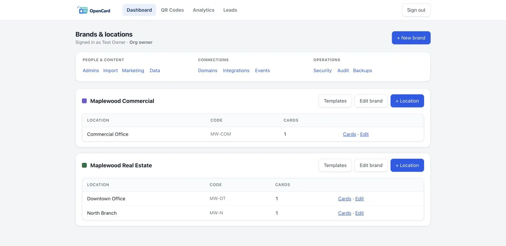
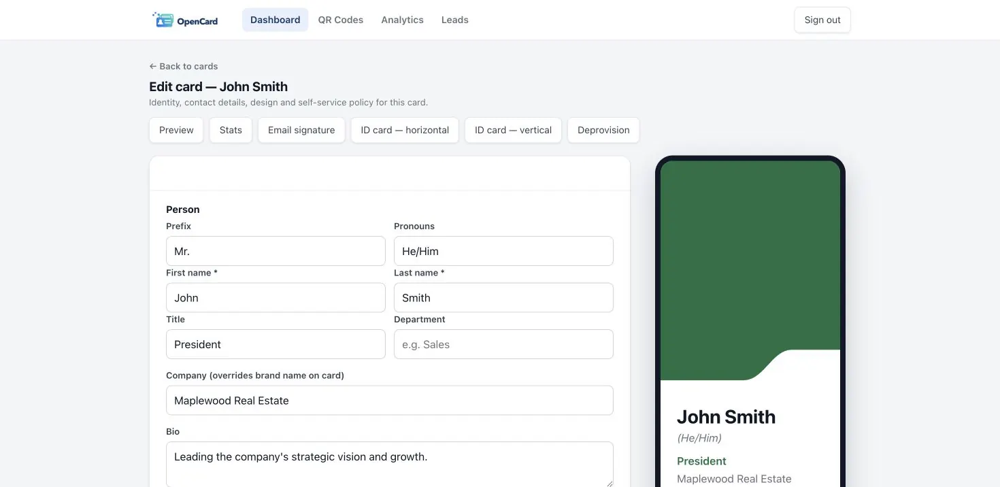
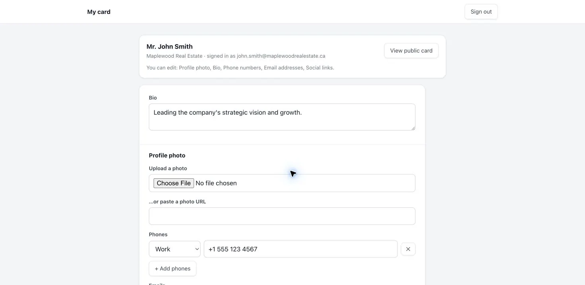
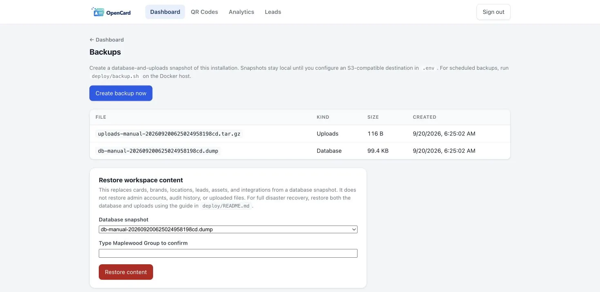

<div align="center">
  
  <h1>OpenCard</h1>
  <p><strong>Digital business cards for one business, on infrastructure you control.</strong></p>
  <p>Give your team shareable cards, a design system, QR codes, lead capture, and an admin dashboard. Keep the app, database, and uploaded media on your own server.</p>
  <p>
    <a href="https://github.com/codebooker/opencard/actions/workflows/ci.yml"></a>
    <a href="LICENSE"></a>
  </p>
  <p><a href="https://opencard.id/">Project site</a> · <a href="https://opencard.id/demo/">Demo card</a> · <a href="deploy/README.md">Install guide</a> · <a href="CHANGELOG.md">Changelog</a></p>
</div>



<sub>Real admin dashboard from a disposable Docker install. More screens below.</sub>

## Run it with Docker Compose

You need Docker with Compose v2. The included stack runs OpenCard and PostgreSQL 16; a new installation starts with **one company and no demo cards**.

```sh
git clone https://github.com/codebooker/opencard.git
cd opencard
cp .env.example .env
# Edit .env: set COMPANY_NAME and three distinct secrets (see below).
docker compose up -d --build
docker compose exec web node dist/scripts/make-admin.js you@example.com "Your Name"
```

In `.env`, generate separate values for `DB_PASSWORD`, `APP_DB_PASSWORD`, and `SESSION_SECRET`—run `openssl rand -hex 32` three times. The final command prints a one-time owner password. Sign in at `http://localhost:3000/admin`, change it, then create a brand, location, and card.

The default web port binds to **localhost only**. For a public deployment, set `APP_URL` to your HTTPS origin and use the [included Caddy profile or your own reverse proxy](deploy/README.md#https-with-included-caddy). Do not expose an HTTP login to the internet.

## Inside the app

| Card editor | Employee self-service |
| :--- | :--- |
| [](site/screenshots/card-editor.webp) | [](site/screenshots/self-service.webp) |
| Edit identity, content, and design with a live preview. | Cardholders edit only the fields their admin allows at `/me`. |

| What ships | Details |
| :--- | :--- |
| **Cards and brands** | Public card URLs, contact downloads, QR images, brand and location templates, and optional printable ID badges. |
| **People and access** | Admin roles, field-level cardholder editing, CSV and Microsoft Entra directory import, optional OIDC/SAML sign-in and SCIM provisioning. |
| **Measurement** | Lead capture, card and QR analytics, campaigns, audit history, API keys, signed webhooks, and optional CRM connections. |
| **Operations** | Local snapshots, workspace-content restore, full database/upload backups, and optional Wasabi or other S3-compatible offsite copies. |

Core cards do not need a third-party account. Integrations need credentials from their respective providers.

## Deliberate scope

OpenCard is **one business per installation**, not a multi-customer SaaS platform. Brands and locations belong to that business. There is no public organization signup, billing, license server, plan tier, or card quota. [opencard.id](https://opencard.id/) is the project website—not a hosted OpenCard account.

You operate the server, HTTPS, updates, monitoring, and disaster recovery. For a public deployment, read the [deployment guide](deploy/README.md) and [security and privacy notes](docs/COMPLIANCE.md) before inviting users.

## Backups you can take with you

Owners can create local snapshots in **Admin → Backups**. Set S3-compatible credentials in `.env` to copy those manual snapshots offsite. For complete disaster recovery, `bash deploy/backup.sh` captures both PostgreSQL and uploaded files; its optional `rclone` target supports Wasabi, R2, AWS S3, and compatible storage. The script never deletes remote objects. [Backup and restore instructions →](deploy/README.md#backups-and-offsite-copies)

[](site/screenshots/backups.webp)

Keep your original `SESSION_SECRET` with your backups, and test a full restore before relying on them.

## Upgrade and development

An existing **single-company** database retains its cards and users. The migration stops if it finds more than one organization; it will not merge or delete customer data. Back up the database and uploads before upgrading. [Upgrade notes →](deploy/README.md#upgrading-from-an-older-opencard-database)

For local development, use Node.js 24 and PostgreSQL 16, install with `npm ci`, apply committed migrations with `npx prisma migrate deploy`, and run `npm run dev`. `npm test` runs the test suite and `npm run build` type-checks and compiles the app. `SEED_DEMO=1 npm run seed` is for an isolated, disposable database only.

Read the [architecture](ARCHITECTURE.md), browse the [deployment runbook](deploy/README.md), or [open an issue](https://github.com/codebooker/opencard/issues). Contributions are welcome.

## License

OpenCard is [GNU AGPL-3.0-only](LICENSE). If you run a modified version for network users, set `SOURCE_URL` to its corresponding source repository.
